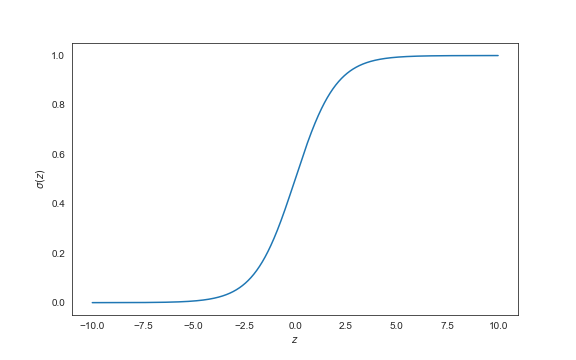

# What Is Statistical Learning?

Suppose we are asked by a client to provide advice on how to improve sales of a particular product. We are given a data set that shows the `sales` of that product, along with the advertising budgets for the product for three different media: `TV`, `radio`, and `newspaper`. It's impossible for our client to increase sales directly, but they do have control over the advertising budgets in each of the three media. Therefore, if we determine that there is an association between advertising budget and sales, we can suggest changing those budgets to thereby increase sales.

In other words,

The problems we solve in data science fall into two broad categories:

1. linear regression
2. classification

As the name suggests, the **linear regression** model is appropriate when predicting a quantitative response (e.g. `income`, `revenue`), and will always predict values from $-\infty$ to $+\infty$.

A **classification** model predicts discrete variables (e.g. `color` or `city`).

The **linear regression** is a popular classification algorithm that shares many properties with the highly interpretable and computationally lean linear regression model. As such, it is by far the most common classification algorithm.

# Expected Value and the Naive Prediction

For a more detailed background on linear regression, visit (LINEAR REGRESSION).

Consider the linear regression equation:

$$\hat{y} = \hat{b} + \hat{w}_1x_1 + \hat{w}_2x_2 + \cdots + \hat{w}_nx_n= \hat{b} + \sum_{i=1}^{n} \hat{w}_ix_i$$

>- $x_i$ -- the $i$th independent variable
>- $w_i$ -- the $i$th coefficient
>- $b$ -- the intercept
>- $\hat{y}$ -- the predicted value of our dependent variable

The linear regression is a highly interpretable model:

- Each of the weights $w_i$ describe an algebraic relationship between a one-unit change in $x_i$ and its effect on $\hat{y}$.
- The intercept $b$ represents a baseline value when all independent variables have a value of $0$.

## The linear regression only works for continuous variables.

However, the linear regression model only works for continuous variables. If we were training a model to categorize images as either `dog` and a `cat`, we could attempt to map this model in the following way:

$$y =
\begin{cases}
0 & \quad \text{if dog}\\
1 & \quad \text{if cat}
\end{cases}
$$

We know that no linear combination of cats would sum up to a dog (e.g. $\text{cat} - \text{cat} \neq \text{dog}$). Furthermore, values such as $0.5$, $1.2$, and $-0.3$ would not hold any real-world meaning (e.g. cat-dog, super-cat, or anti-dog). How do we confine our function to only output within the range $[0, 1]$?

> We only focus on range $[0, 1]$ since we previously defined the bounds to mean `dog` and `cat`, respectively. If we had defined our categories as $1$ and $2$ we would want to confine our model to the range $[1, 2]$.

# The Logistic Regression
The logistic regression is a mathematical model that allows us to map the *probability* of belonging to one of multiple categories:

$$\hat{y} = P(y = 1)$$

Thus, a value of $0.8$ would mean that the model predicts the example to be 80% a cat, 20% a dog.

In order to confine our function to range $[0, 1]$, we commonly use the *sigmoid function*:

$$\sigma(z) = \frac{1}{1 + e^{-z}}$$

The function asymptotically approaches $1$ when reaching values of positive infinity (and $0$ at negative infinity), allowing us to map all the real numbers in the desired range.

The logistic regression equation is just the linear regression output fed into the sigmoid function.

$$z =  \sum_{i=1}^{n} w_ix_i + b$$
$$\hat{y} = \sigma(z)$$

## Logistic Regression model optimization is achieved via the Logistic Loss function.

A simple least-squared error can't be used for a logistic regression since our output variable is no longer linear. Predicting $\hat{y} = 0.9$ means $P(y = 1) = 0.9$. This means that $y$ is predicted to be 9 times as likely to be $1$ than $0$. However, $\hat{y} = 0.8$ means $y$ is predicted to be 4 times as likely to be $1$ than $0$; this is because the odds.