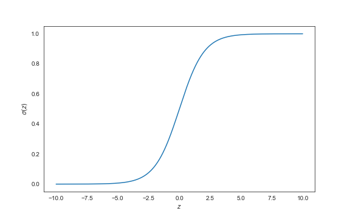

# The Linear Regression
Consider the linear regression equation:

$$\hat{y} = w_1x_1 + w_2x_2 + \cdots + w_nx_n + b = \sum_{i=1}^{n} w_ix_i + b$$

where:

- $x_i$ -- the $i$th independent variable
- $w_i$ -- the $i$th coefficient
- $b$ -- the intercept
- $\hat{y}$ -- the predicted value of our dependent variable

As the name suggests, the linear regression model is appropriate when predicting the value of linear variables (e.g. `income`).

However, if we were trying to distinguish between a `dog` and a `cat`, we could attempt to map this model in the following way:

$$\hat{y} =
\begin{cases}
0 & \quad \text{if dog}\\
1 & \quad \text{if cat}
\end{cases}
$$

But still, we know that no linear combination of cats would sum up to a dog (e.g. $\text{cat} - \text{cat} \neq \text{dog}$). Furthermore, values such as $0.5$, $1.2$, and $-0.3$ would not hold any real-world meaning (e.g. cat-dog, super-cat, or anti-dog). Thus, the use of a linear regression would not be appropriate in this context.

# The Logistic Regression
The logistic regression is a mathematical model that allows us to map the *probability* of belonging to one of multiple categories. Thus, a $0.5$ would mean that the model predicts the input to be equally likely to be a `dog` or a `cat`.

Revisiting the equation for a linear regression:

$$\hat{y} =  \sum_{i=1}^{n} w_ix_i + b$$

we run into a problem where the model could predict a value outside of the range $[0, 1]$. Therefore, we must map our predicted values to a function whose bounds fall within that range. For a logistic regression, we commonly use the *sigmoid function*:

$$\sigma(z) = \frac{1}{1 + e^{-z}}$$

The function asymptotically approaches $1$ when reaching values of positive infinity (and $0$ at negative infinity), allowing us to map all the real numbers in the desired range.

The logistic regression equation is just the linear regression output fed into the sigmoid function.

$$z =  \sum_{i=1}^{n} w_ix_i + b$$
$$\hat{y} = \sigma(z)$$

